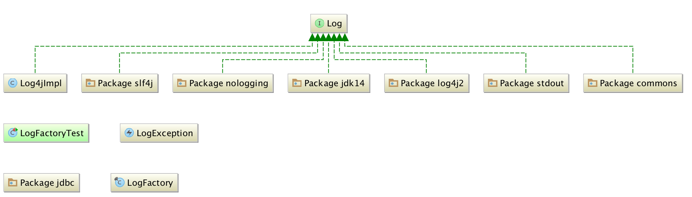

Mybatis源码解读.md

##1.日志
logging package下的类图如下：

作为基础框架，本身的日志独立于任意日志框架，避免强绑定带来的依赖传递，同时又尽可能支持现有的任意日志框架，对具体使用的业务环境更友好。

mybatis按照如下顺序尝试加载具体日志框架：
    
    slf4j》commons-logging》log4j2》log4j》jdk-logging》no-log（丢弃所有日志）

从这里可以看出来，mybatis并未支持logback，如果日志用logback，最好还是通过slf4j来驱动。

##2.缓存
###BlockingCache
为每一个cache的数据项，映射一个ReentrantLock。然后在获取指定key的数据时，阻塞并等待对应的锁。阻塞可以设定一定的超时时间，也可以持续等待。

###FifoCache
基于双端队列的方式，提供先进先出的缓存操作模式。初始化大小为1024，可以自定义大小。选定的双端队列为LinkedList，本身不提供线程安全支持，需要业务方自行处理。

###LoggingCache
在获取指定key的value的时候，累加请求次数，累加查询成功次数，然后输出命中率。

###LruCache
最近最少使用缓存。基于LinkedHashMap，当缓存容量超出初始容量后，将移除队列头部的后一个元素进而驱动缓存在新增元素时移除旧元素。添加新元素时，判断是否有需要移除的元素，此时如果并发，可能导致缓存中的部分数据无法被删除，导致内存泄露。所以，使用此次缓存需要业务方进行线程安全处理。