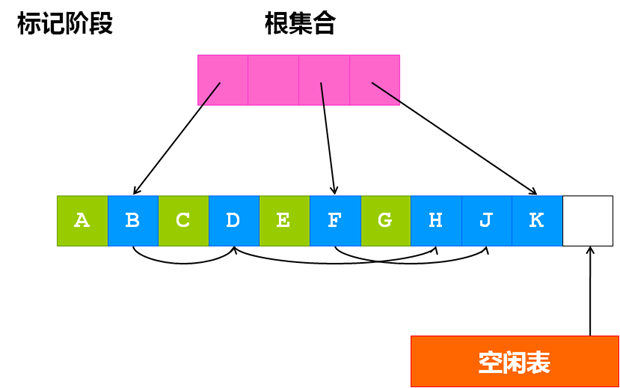
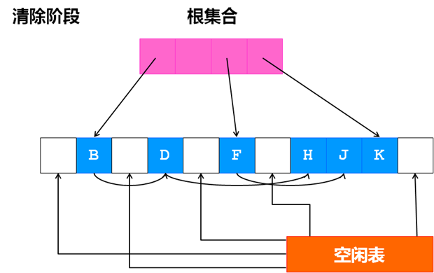
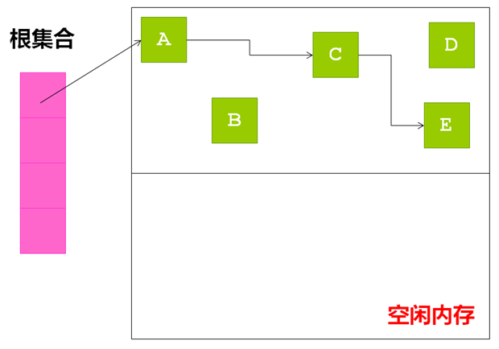
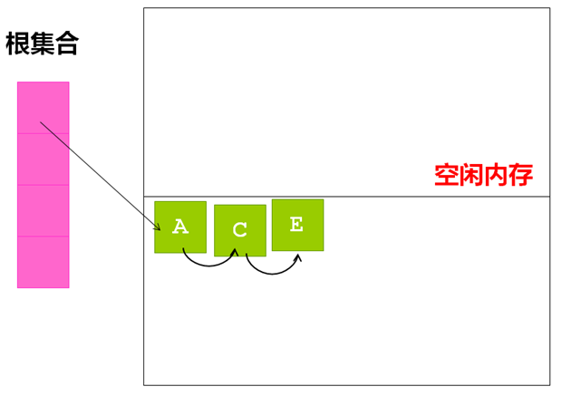

#垃圾回收

垃圾回收就是自动发现并回收不在被使用的内存，不需要程序员协助的这一过程。能够解决内存泄露，空指针引用等问题。算法包括：引用计数；引用跟踪；三色标记；分代回收等。

##引用计数
引用计数是每个对象计算指向它的指针的数量，当有一个指针指向自己的时候，引用数加1，删除一个指向自己的指针后，引用数减1，当计数值为0时，则标记可安全销毁。

    优点：执行垃圾回收的时候，不需要挂起程序。
    缺点：
        1.  每次创建和销毁指针引用的时候，都需要更新引用计数，会带来额外的开销；
        2.  无法处理环形引用。

##引用跟踪
引用跟踪是针对所有对象，通过遍历进行存活判断，不可达对象，则标记可安全销毁。
###标记-清除
从根节点，往下遍历所有对象。可达，则为存活，不可达，则为可销毁。这一个过程分为2个阶段。第一阶段：遍历对象并标记；第二阶段：销毁所有垃圾对象。
简单实现标记-清理算法时，对于每个可达对象，一般都会使用一个 标记位（mark bit）来表示该对象是否已经被标记过。为对象分配内存时，为了满足对齐要求，其起始地址一般都是偶数，因此，对象指针的最低位总是0，正适合用来做标记位。

    优点：能够自然解决环形引用的问题，并且没有更新引用计数带来的额外开销。
    缺点：
        1.  需要暂停应用程序来完成这一过程；    
        2.  清除垃圾对象这一个阶段，会造成大量的内存碎片。

####三色标记
三色标记，本质上是标记-清除算法的一个并发版本。
不再为每个对象设置一个2进制的标记位，而是使用一个带有3个可选值的变量来表示对象的标记状态，具体值为 白色、灰色、黑色（white, grey, black）。其中，标记为白色的对象表示是已死对象，将会被回收掉，那些不包含指向白色对象的引用的对象被标记为黑色。在标记阶段开始的时候，根集合中的对象被标记为灰色，其他所有的对象被标记为白色，由于无法获知根集合中对象的子对象的状态，所以也将之标记为 白色，此时不存在黑色对象，而标记算法的目的就是要找到这些对象。

伪代码实现：

    标记:
        默认将所有对象标记为白色
        将根集合中的对象标记为灰色
        if 灰色对象 exists:
            for x in 灰色对象:
                for y in (x引用的白色对象):
                    将y标记为灰色
                if x所有的引用都指向另一个灰色对象:
                    将x标记为黑色
    清理:
        回收所有白色对象

###标记-缩进
在标记-清除之后，进行了一次内存调整，消除了内存碎片。
优缺点同上。

###标记-复制
复制是把堆分割为2个区域(From，To)，GC的过程，就是将标记存活的对象，从From区域复制到To区域。复制完成后，区域角色互换，为下一次复制做准备。

    优点：
        1.  能够自然解决环形引用的问题，并且没有更新引用计数带来的额外开销；
        2.  在复制的过程中，可以自然重排列内存，故不存在内存碎片的可能。
    缺点：
        1.  需要暂停应用程序来完成这一过程；
        2.  需要消耗双倍内存空间；

