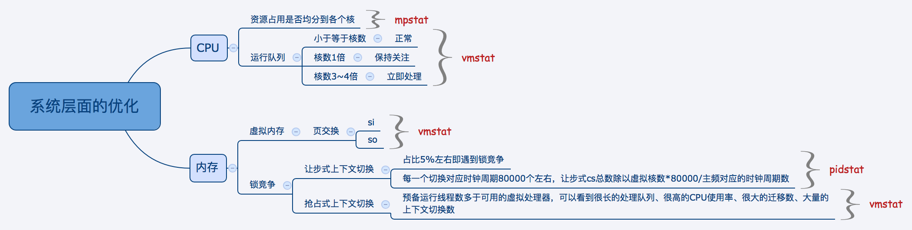
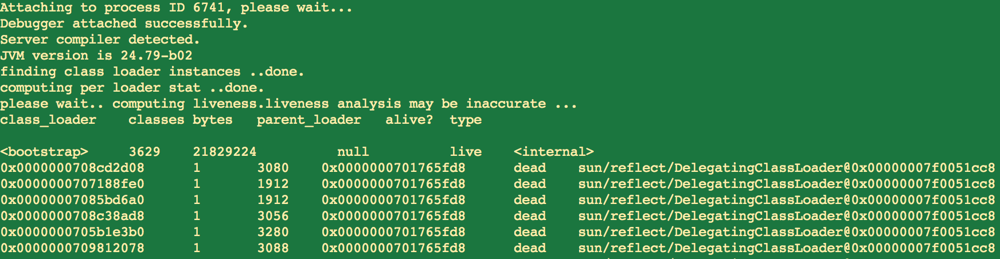

# 性能调优

## 系统优化



## jps
### 介绍
jps主要用来输出JVM中运行的进程状态信息，语法格式如下：

 ```
 jps [options] [hostid]
 ```

### 命令参数如下

 ```
-q 不输出类名、Jar名和传入main方法的参数
-m 输出传入main方法的参数
-l 输出main类或Jar的全限名
-v 输出传入JVM的参数
 ```

## jstack
### 介绍
jstack主要用来查看某个Java进程内的线程堆栈信息，语法格式如下：
```
jstack [option] pid
jstack [option] executable core
jstack [option] [server-id@]remote-hostname-or-ip
```
### 命令行参数如下
```
-l long listings，会打印出额外的锁信息，在发生死锁时可以用jstack -l pid来观察锁持有情况
-m mixed mode，不仅会输出Java堆栈信息，还会输出C/C++堆栈信息（比如Native方法）
```
### 定位问题示例
jstack可以定位到线程堆栈，基于堆栈信息可以定位到代码。定位某个Java进程中最耗费CPU的Java线程并定位堆栈信息的步骤如下：
1. ps -ef | grep xxx应用  定位到应用pid
2. top -Hp pid 找到最耗费CPU或者内存的tid
3. 如果当前用户和进程用户不一致，执行jstack会报如下异常
```
[root@xxx manage]# jstack 6741 | grep 1d02
6741: Unable to open socket file: target process not responding or HotSpot VM not loaded
The -F option can be used when the target process is not responding
```
切换用户到进程启动用户 su xxx or su -xxx
4. jstack pid | grep tid 输出如下:
```
[tomcat@xxx manage]$ jstack 6741 | grep 1d02
"DubboServerHandler-1.2.4.2:29880-thread-195" daemon prio=10 tid=0x00000000020d0800 nid=0x1d02 waiting on condition [0x00002adbe1ba5000]
```

##  jmap（Memory Map）和jhat（Java Heap Analysis Tool）
### 介绍
jmap用来查看堆内存使用状况，一般结合jhat使用。
jmap语法格式如下：
```
jmap [option] pid
jmap [option] executable core
jmap [option] [server-id@]remote-hostname-or-ip
```
如果运行在64位JVM上，可能需要指定-J-d64命令选项参数。
```
jmap -permstat pid
```
打印进程的类加载器和类加载器加载的持久代对象信息，输出：类加载器名称、对象是否存活（不可靠）、对象地址、父类加载器、已加载的类大小等信息，如下图：


使用jmap -heap pid查看进程堆内存使用情况，包括使用的GC算法、堆配置参数和各代中堆内存使用情况。
```
[root@xxx manage]# jmap -heap 6741
Attaching to process ID 6741, please wait...
Debugger attached successfully.
Server compiler detected.
JVM version is 24.79-b02

using parallel threads in the new generation.
using thread-local object allocation.
Concurrent Mark-Sweep GC

Heap Configuration:
   MinHeapFreeRatio = 40
   MaxHeapFreeRatio = 70
   MaxHeapSize      = 5368709120 (5120.0MB)
   NewSize          = 1342177280 (1280.0MB)
   MaxNewSize       = 1342177280 (1280.0MB)
   OldSize          = 5439488 (5.1875MB)
   NewRatio         = 2
   SurvivorRatio    = 8
   PermSize         = 100663296 (96.0MB)
   MaxPermSize      = 268435456 (256.0MB)
   G1HeapRegionSize = 0 (0.0MB)

Heap Usage:
New Generation (Eden + 1 Survivor Space):
   capacity = 1207959552 (1152.0MB)
   used     = 605313488 (577.2719268798828MB)
   free     = 602646064 (574.7280731201172MB)
   50.11041031943427% used
Eden Space:
   capacity = 1073741824 (1024.0MB)
   used     = 601748000 (573.8716125488281MB)
   free     = 471993824 (450.1283874511719MB)
   56.0421496629715% used
From Space:
   capacity = 134217728 (128.0MB)
   used     = 3565488 (3.4003143310546875MB)
   free     = 130652240 (124.59968566894531MB)
   2.6564955711364746% used
To Space:
   capacity = 134217728 (128.0MB)
   used     = 0 (0.0MB)
   free     = 134217728 (128.0MB)
   0.0% used
 ......
```

使用jmap -histo[:live] pid查看堆内存中的对象数目、大小统计直方图，如果带上live则只统计活对象，如下：
```
[tomcat@xxx tmp]$ jmap -histo:live 6741 | more

 num     #instances         #bytes  class name
----------------------------------------------
   1:        212680       48384976  [C
   2:         53638       44399400  [B
   3:        153613       24541152  <constMethodKlass>
   4:        153613       19677056  <methodKlass>
   5:         14521       16911040  <constantPoolKlass>
   6:         14487       10351744  <instanceKlassKlass>
   7:         12453       10062560  <constantPoolCacheKlass>
   8:          9114        5154432  <methodDataKlass>
   9:        204160        4899840  java.lang.String
  10:        116153        3716896  java.util.HashMap$Entry
  11:         31189        2495120  java.lang.reflect.Method
  12:         17984        2361648  [Ljava.util.HashMap$Entry;
  13:         55761        2230440  java.util.LinkedHashMap$Entry
  14:         49713        1590816  java.util.concurrent.ConcurrentHashMap$HashEntry
  15:         15417        1485384  java.lang.Class
  16:         28306        1443560  [Ljava.lang.Object;
```
class name是对象类型：
```
B  byte
C  char
D  double
F  float
I  int
J  long
Z  boolean
[  数组，如[I表示int[]
[L+类名 其他对象
```

还有一个很常用的情况是：用jmap把进程内存使用情况dump到文件中，再用jhat分析查看。jmap进行dump命令格式如下：
```
jmap -dump:format=b,file=dumpFileName pid
```

## jstat
### 介绍
Jstat用于监控基于HotSpot的JVM，对其堆的使用情况进行实时的命令行的统计，使用jstat我们可以对指定的JVM做如下监控：
- 类的加载及卸载情况
- 查看新生代、老生代及持久代的容量及使用情况
- 查看新生代、老生代及持久代的垃圾收集情况，包括垃圾回收的次数及垃圾回收所占用的时间
- 查看新生代中Eden区及Survior区中容量及分配情况等
jstat工具特别强大，它有众多的可选项，通过提供多种不同的监控维度，使我们可以从不同的维度来了解到当前JVM堆的使用情况。详细查看堆内各个部分的使用量，使用的时候必须加上待统计的Java进程号，可选的不同维度参数以及可选的统计频率参数。

### 语法
jstat [ generalOption | outputOptions vmid [interval[s|ms] [count]] ]

    generalOption - 单个的常用的命令行选项，如-help, -options, 或 -version。
    outputOptions -一个或多个输出选项，由单个的statOption选项组成，可以和-t, -h, and -J等选项配合使用。
    statOption：
    根据jstat统计的维度不同，可以使用如下表中的选项进行不同维度的统计，不同的操作系统支持的选项可能会不一样，可以通过-options选项，查看不同操作系统所支持选项，

如：

    Option  Displays...
    class   用于查看类加载情况的统计
    compiler    用于查看HotSpot中即时编译器编译情况的统计
    gc  用于查看JVM中堆的垃圾收集情况的统计
    gccapacity  用于查看新生代、老生代及持久代的存储容量情况
    gccause 用于查看垃圾收集的统计情况（这个和-gcutil选项一样），如果有发生垃圾收集，它还会显示最后一次及当前正在发生垃圾收集的原因。
    gcnew   用于查看新生代垃圾收集的情况
    gcnewcapacity   用于查看新生代的存储容量情况
    gcold   用于查看老生代及持久代发生GC的情况
    gcoldcapacity   用于查看老生代的容量
    gcpermcapacity  用于查看持久代的容量
    gcutil  用于查看新生代、老生代及持代垃圾收集的情况
    printcompilation    HotSpot编译方法的统计

### 不同统计维度及输出说明
- class
```
类加载情况的统计
列名  说明
Loaded  加载了的类的数量
Bytes   加载了的类的大小，单为Kb
Unloaded    卸载了的类的数量
Bytes   卸载了的类的大小，单为Kb
Time    花在类的加载及卸载的时间
```

- compiler
```
HotSpot中即时编译器编译情况的统计
列名  说明
Compiled    编译任务执行的次数
Failed  编译任务执行失败的次数
Invalid 编译任务非法执行的次数
Time    执行编译花费的时间
FailedType  最后一次编译失败的编译类型
FailedMethod    最后一次编译失败的类名及方法名
```
     
- gc
```
JVM中堆的垃圾收集情况的统计
列名  说明
S0C 新生代中Survivor space中S0当前容量的大小（KB）
S1C 新生代中Survivor space中S1当前容量的大小（KB）
S0U 新生代中Survivor space中S0容量使用的大小（KB）
S1U 新生代中Survivor space中S1容量使用的大小（KB）
EC  Eden space当前容量的大小（KB）
EU  Eden space容量使用的大小（KB）
OC  Old space当前容量的大小（KB）
OU  Old space使用容量的大小（KB）
PC  Permanent space当前容量的大小（KB）
PU  Permanent space使用容量的大小（KB）
YGC 从应用程序启动到采样时发生 Young GC 的次数
YGCT    从应用程序启动到采样时 Young GC 所用的时间(秒)
FGC 从应用程序启动到采样时发生 Full GC 的次数
FGCT    从应用程序启动到采样时 Full GC 所用的时间(秒)
GCT T从应用程序启动到采样时用于垃圾回收的总时间(单位秒)，它的值等于YGC+FGC
```
    
- gccapacity
```
新生代、老生代及持久代的存储容量情况
列名  说明
NGCMN   新生代的最小容量大小（KB）
NGCMX   新生代的最大容量大小（KB）
NGC 当前新生代的容量大小（KB）
S0C 当前新生代中survivor space 0的容量大小（KB）
S1C 当前新生代中survivor space 1的容量大小（KB）
EC  Eden space当前容量的大小（KB）
OGCMN   老生代的最小容量大小（KB）
OGCMX   老生代的最大容量大小（KB）
OGC 当前老生代的容量大小（KB）
OC  当前老生代的空间容量大小（KB）
PGCMN   持久代的最小容量大小（KB）
PGCMX   持久代的最大容量大小（KB）
PGC 当前持久代的容量大小（KB）
PC  当前持久代的空间容量大小（KB）
YGC 从应用程序启动到采样时发生 Young GC 的次数
FGC 从应用程序启动到采样时发生 Full GC 的次数
```

- gccause
```
     这个选项用于查看垃圾收集的统计情况（这个和-gcutil选项一样），如果有发生垃圾收集，它还会显示最后一次及当前正在发生垃圾收集的原因，它比-gcutil会多出最后一次垃圾收集原因以及当前正在发生的垃圾收集的原因。
用于查看垃圾收集的统计情况，包括最近发生垃圾的原因
列名  说明
LGCC    最后一次垃圾收集的原因，可能为“unknown GCCause”、“System.gc()”等
GCC 当前垃圾收集的原因
```
    
- gcnew
```
新生代垃圾收集的情况
列名  说明
S0C 当前新生代中survivor space 0的容量大小（KB）
S1C 当前新生代中survivor space 1的容量大小（KB）
S0U S0已经使用的大小（KB）
S1U S1已经使用的大小（KB）
TT  Tenuring threshold，要了解这个参数，我们需要了解一点Java内存对象的结构，在Sun JVM中，（除了数组之外的）对象都有两个机器字（words）的头部。第一个字中包含这个对象的标示哈希码以及其他一些类似锁状态和等标识信息，第二个字中包含一个指向对象的类的引用，其中第二个字节就会被垃圾收集算法使用到。
在新生代中做垃圾收集的时候，每次复制一个对象后，将增加这个对象的收集计数，当一个对象在新生代中被复制了一定次数后，该算法即判定该对象是长周期的对象，把他移动到老生代，这个阈值叫着tenuring threshold。这个阈值用于表示某个/些在执行批定次数youngGC后还活着的对象，即使此时新生的的Survior没有满，也同样被认为是长周期对象，将会被移到老生代中。
MTT Maximum tenuring threshold，用于表示TT的最大值。
DSS Desired survivor size (KB).可以参与这里：http://blog.csdn.net/yangjun2/article/details/6542357
EC  Eden space当前容量的大小（KB）
EU  Eden space已经使用的大小（KB）
YGC 从应用程序启动到采样时发生 Young GC 的次数
YGCT    从应用程序启动到采样时 Young GC 所用的时间(单位秒)
```

- gcnewcapacity
```
新生代的存储容量情况
列名  说明
NGCMN           新生代的最小容量大小（KB）
NGCMX       新生代的最大容量大小（KB）
NGC     当前新生代的容量大小（KB）
S0CMX   新生代中SO的最大容量大小（KB）
S0C 当前新生代中SO的容量大小（KB）
S1CMX   新生代中S1的最大容量大小（KB）
S1C 当前新生代中S1的容量大小（KB）
ECMX    新生代中Eden的最大容量大小（KB）
EC  当前新生代中Eden的容量大小（KB）
YGC 从应用程序启动到采样时发生 Young GC 的次数
FGC 从应用程序启动到采样时发生 Full GC 的次数
```

- gcold
```
老生代及持久代发生GC的情况
列名  说明
PC  当前持久代容量的大小（KB）
PU  持久代使用容量的大小（KB）
OC  当前老年代容量的大小（KB）
OU  老年代使用容量的大小（KB）
YGC 从应用程序启动到采样时发生 Young GC 的次数
FGC 从应用程序启动到采样时发生 Full GC 的次数
FGCT    从应用程序启动到采样时 Full GC 所用的时间(单位秒)
GCT 从应用程序启动到采样时用于垃圾回收的总时间(单位秒)，它的值等于YGC+FGC
```

- gcoldcapacity
```
老生代的存储容量情况
列名  说明
OGCMN   老生代的最小容量大小（KB）
OGCMX   老生代的最大容量大小（KB）
OGC 当前老生代的容量大小（KB）
OC  当前新生代的空间容量大小（KB）
YGC 从应用程序启动到采样时发生 Young GC 的次数
FGC 从应用程序启动到采样时发生 Full GC 的次数
FGCT    从应用程序启动到采样时 Full GC 所用的时间(单位秒)
GCT 从应用程序启动到采样时用于垃圾回收的总时间(单位秒)，它的值等于YGC+FGC
```

- gcpermcapacity
```
    从应用程序启动到采样时发生 Full GC 的次数
持久代的存储容量情况
列名  说明
PGCMN   持久代的最小容量大小（KB）
PGCMX   持久代的最大容量大小（KB）
PGC 当前持久代的容量大小（KB）
PC  当前持久代的空间容量大小（KB）
YGC 从应用程序启动到采样时发生 Young GC 的次数
FGC
FGCT    从应用程序启动到采样时 Full GC 所用的时间(单位秒)
GCT 从应用程序启动到采样时用于垃圾回收的总时间(单位秒)，它的值等于YGC+FGC
```

- gcutil
```
新生代、老生代及持代垃圾收集的情况
列名  说明
S0  Heap上的 Survivor space 0 区已使用空间的百分比
S1  Heap上的 Survivor space 1 区已使用空间的百分比
E   Heap上的 Eden space 区已使用空间的百分比
O   Heap上的 Old space 区已使用空间的百分比
P   Perm space 区已使用空间的百分比
YGC 从应用程序启动到采样时发生 Young GC 的次数
YGCT    从应用程序启动到采样时 Young GC 所用的时间(单位秒)
FGC 从应用程序启动到采样时发生 Full GC 的次数
FGCT    从应用程序启动到采样时 Full GC 所用的时间(单位秒)
GCT 从应用程序启动到采样时用于垃圾回收的总时间(单位秒)，它的值等于YGC+FGC
```
    
- printcompilation
```
HotSpot编译方法的统计
列名  说明
Compiled    编译任务执行的次数
Size    方法的字节码所占的字节数
Type    编译类型
Method  指定确定被编译方法的类名及方法名，类名中使名“/”而不是“.”做为命名分隔符，方法名是被指定的类中的方法，这两个字段的格式是由HotSpot中的“-XX:+PrintComplation”选项确定的。
```