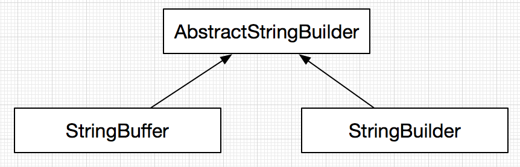

# StringBuffer&StringBuilder

如上所示，StringBuffer&StringBuilder都实现了AbstractStringBuilder了，两者的差别体现在API上的synchronized同步原语。

* StringBuffer每个操作数据的API上都加上了synchronized，适合多线程场景下操作共享数据
* StringBuilder则没有，适合在单线程下，或者无并发操作数据的场景。从执行效率上来说，API上没有同步原语会更快一些。

AbstractStringBuilder内建一个字符数组与一个计数器，所有的操作都是对这个数组进行处理。那这样一来，通过设定合适的初始化容量可以有效的降低不断append内容导致的数组扩容。这种设计相比String的“+”操作，可以避免大量的创建临时对象，提升内存使用效率。