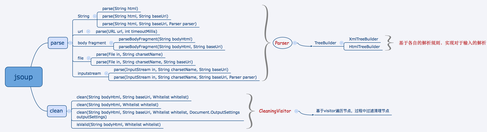

# jsoup
官网：https://jsoup.org/

jsoup是一个用于处理HTML的Java类库。它提供了了一些非常方便的API来提取和操作数据，用近似于jquery的方法来操作DOM，CSS等。
jsoup实现了标准的HTML5规范，将HTML解析成的DOM和浏览器一样。

- 使用DOM遍历器或者CSS选择器来查找与提取数据
- 操作HTML的元素，属性，以及文本
- 根据安全白名单清理用户提交的内容，防止XSS攻击
- 输出规范的HTML

jsoup设计于处理各种场景下的HTML，从原始模型到验证模型，到无效标签的处理等，jsoup会创建一个处理合适的解析树。

## 源码解读

从多来源读入数据完成解析或者清理，输出最终的Document。

## 示例
将维基百科官网解析成DOM，然后从新闻部分中选择标题列入元素列表。
```
Document doc = Jsoup.connect("http://en.wikipedia.org/").get();
Elements newsHeadlines = doc.select("#mp-itn b a");
```
## 具体使用介绍 针对其Cookbook contents的翻译
### 介绍
#### 解析与遍历Document
HTML document解析示例：
```
String html = "<html><head><title>First parse</title></head>"
  + "<body><p>Parsed HTML into a doc.</p></body></html>";
Document doc = Jsoup.parse(html);
```
不论你提供的HTML是否正确，解析器都将尽力为提供的HTML创建一个干净的的解析。
它可以处理如下类型：
- 未关闭的标签(比如：
```
<p>Lorem <p>Ipsum parses to <p>Lorem</p> <p>Ipsum</p>)
```
- 隐含标签(例如：
```
a naked <td>Table data</td> is wrapped into a <table><tr><td>...)
```
- 创建可靠的document结构(html中包含head与body，并且在head中有合适的一些元素)

document的对象模型
- document 由一系列元素与文本节点构成(以及其它一些节点：具体可以看节点树)
- 继承链：Document extends Element extends Node. TextNode extends Node.
- 一个元素包含若干个子节点，同时有一个父元素，提供用于过滤子元素的过滤器。
### 读入
#### 从字符串中解析document
##### 问题
在Java中有一个HTML字符串，你想获取其内容，或者确认格式是否正确，或者做一定的更改。字符串可能从用户输入，文件，或者网络中得到。
##### 解决方案
使用static Jsoup.parse(String html) 方法，或者 Jsoup.parse(String html, String baseUri)。如果页面来自网页，你需要获取其绝对路径。
```
String html = "<html><head><title>First parse</title></head>"
  + "<body><p>Parsed HTML into a doc.</p></body></html>";
Document doc = Jsoup.parse(html);
```
##### 介绍
parse(String html, String baseUri)方法将输入的HTML解析成document，baseUri参数用于将相对URL解析成绝对URL，parse将基于此获取document。如果此方法不适用，或者你知道HTML有基础的元素，你可以使用parse(String html)方法。
只要你给非空字符，就可以获得一个成功的，处理合适的解析。这个document至少会包括head与body元素。
当你获得document后，可以通过合适的方式从中获取数据，元素以及节点。
#### 解析body片段
##### 问题
针对HTML的body片段(例如：一个div包括一对p标签，并不是一个完整的document)进行解析。可能来自用户提交的评论或者页面中CMS编辑的内容。
##### 解决方案
使用Jsoup.parseBodyFragment(String html)方法：
```
String html = "<div><p>Lorem ipsum.</p>";
Document doc = Jsoup.parseBodyFragment(html);
Element body = doc.body();
```
##### 介绍
parseBodyFragment方法创建了一个空的document，然后将解析出来的HTML插入body元素。如果你使用常规的Jsoup.parse(String html)方法，通常会得到同样的结果。但是将输入显示的视为body片段可以确保用户输入的任意有坏味道的HTML都可以被解析成body元素。
Document.body()方法会返回body元素的内容。等价于doc.getElementsByTag("body")。
##### 安全注意
如果你接受用户输入的HTML，需要注意cross-site脚本攻击。可以看白名单清理文档，用clean(String bodyHtml, Whitelist whitelist)方法来清理输入。
#### 从URL加载Document
##### 问题
需要从网页获取并且解析HTML，并从中获取数据。
##### 解决方案
使用Jsoup.connect(String url)方法：
```
Document doc = Jsoup.connect("http://example.com/").get();
String title = doc.title();
```
##### 介绍
connect(String url)方法创建了一个新的连接，然后用get()方法获取并解析HTML。如果在获取URL时出现错误，会抛出一个IOException，你需要做出合适的处理。

Connection接口设计于用方法链来构建一个指定的request：
```
Document doc = Jsoup.connect("http://example.com")
  .data("query", "Java")
  .userAgent("Mozilla")
  .cookie("auth", "token")
  .timeout(3000)
  .post();
```
这些方法仅仅支持网页的URL(http与https协议)；如果我需要从本地文件加载，使用parse(File in, String charsetName)方法替换。
#### 从文件加载Document
##### 问题
在本地磁盘上有一个HTML文件，需要进行加载与解析，然后对其进行相关操作或者提取数据。
##### 解决方案
使用静态方法 Jsoup.parse(File in, String charsetName, String baseUri)
```
File input = new File("/tmp/input.html");
Document doc = Jsoup.parse(input, "UTF-8", "http://example.com/");
```
##### 介绍
这个功能对于在本地文件系统工作的站点有一定用处，通过相对链接指向本地文件系统。
parse(File in, String charsetName, String baseUri)方法加载并解析HTML文件。如果在加载文件时产生错误，会抛出IOException，需要进行合适的处理。
针对Document，在<base href>元素被找到前，解析器将baseUri参数解析成相对URL。如果你并不关注这个，你可以用空字符替代。
有一个同类方法parse(File in, String charsetName)，用文件位置作为baseUri。
如果你在本地文件系统上工作并且相对链接也指向文件系统，那这个功能将相当有用。
### 提取数据
#### 使用DOM方法对Document进行导航
##### 问题
基于对HTML Document的一般理解，从一个HTML Document中提取数据。
##### 解决方案
将HTML解析成Document后可以使用DOM友好的方法。
```
File input = new File("/tmp/input.html");
Document doc = Jsoup.parse(input, "UTF-8", "http://example.com/");

Element content = doc.getElementById("content");
Elements links = content.getElementsByTag("a");
for (Element link : links) {
  String linkHref = link.attr("href");
  String linkText = link.text();
}
```
##### 介绍
元素提供一组DOM友好方法用于查找元素，提取与操作其数据。获取的DOM是上下文全局有效的：在父Document查找到的元素会在Document下；在子元素下查找到的元素会在其子节点中。通过这种方式你可以选择所需的数据。
- 查找元素
    * getElementById(String id)
    * getElementsByTag(String tag)
    * getElementsByClass(String className)
    * getElementsByAttribute(String key) (and related methods)
    * Element siblings: siblingElements(), firstElementSibling(), lastElementSibling(); nextElementSibling(), previousElementSibling()
    * Graph: parent(), children(), child(int index)
- 元素数据
    * attr(String key) to get and attr(String key, String value) to set attributes
    * attributes() to get all attributes
    * id(), className() and classNames()
    * text() to get and text(String value) to set the text content
    * html() to get and html(String value) to set the inner HTML content
    * outerHtml() to get the outer HTML value
    * data() to get data content (e.g. of script and style tags)
    * tag() and tagName()
- 操作HTML与文本
    * append(String html), prepend(String html)
    * appendText(String text), prependText(String text)
    * appendElement(String tagName), prependElement(String tagName)
    * html(String value)
#### 使用选择器语法查询元素
##### 问题
可以使用CSS或者近似jQuery选择器的语法来查找或者操作元素。
##### 解决方案
使用Element.select(String selector) 与 Elements.select(String selector)方法：
```
File input = new File("/tmp/input.html");
Document doc = Jsoup.parse(input, "UTF-8", "http://example.com/");

Elements links = doc.select("a[href]"); // a with href
Elements pngs = doc.select("img[src$=.png]");
  // img with src ending .png

Element masthead = doc.select("div.masthead").first();
  // div with class=masthead

Elements resultLinks = doc.select("h3.r > a"); // direct a after h3
```

##### 介绍
jsoup支持近似CSS或者jQuery的选择器语法用于查询满足条件的元素，能提供功能完善且强大的查询支持。
select方法针对Document，Element，Elements有效。API在整个上下文全局有效，可以基于特定元素或者链式查询进行过滤。
select会返回一组元素(Elements)，方法提供了一个可以获取数据和操作结果的元素范围。
* Selector 概览
    - tagname: 通过标签查找元素, e.g. a
    - ns|tag: 在命令空间中通过标签查找元素, e.g. fb|name finds <fb:name> elements
    - #id: 通过id查找元素
    - , e.g. #logo
    - .class: find elements by class name, e.g. .masthead
    - [attribute]: elements with attribute, e.g. [href]
    - [^attr]: elements with an attribute name prefix, e.g. [^data-] finds elements with HTML5 dataset attributes
    - [attr=value]: elements with attribute value, e.g. [width=500] (also quotable, like [data-name='launch sequence'])
    - [attr^=value], [attr$=value], [attr*=value]: elements with attributes that start with, end with, or contain the value, e.g. [href*=/path/]
    - [attr~=regex]: elements with attribute values that match the regular expression; e.g. img[src~=(?i)\.(png|jpe?g)]
    - *: all elements, e.g. *
* Selector 组合
    - el#id: elements with ID, e.g. div#logo
    - el.class: elements with class, e.g. div.masthead
    - el[attr]: elements with attribute, e.g. a[href]
    - Any combination, e.g. a[href].highlight
    - ancestor child: child elements that descend from ancestor, e.g. .body p finds p elements anywhere under a block with class "body"
    - parent > child: child elements that descend directly from parent, e.g. div.content > p finds p elements; and body > * finds the direct children of the body tag
    - siblingA + siblingB: finds sibling B element immediately preceded by sibling A, e.g. div.head + div
    - siblingA ~ siblingX: finds sibling X element preceded by sibling A, e.g. h1 ~ p
    - el, el, el: group multiple selectors, find unique elements that match any of the selectors; e.g. div.masthead, div.logo
* 伪选择器
    - :lt(n): find elements whose sibling index (i.e. its position in the DOM tree relative to its parent) is less than n; e.g. td:lt(3)
    - :gt(n): find elements whose sibling index is greater than n; e.g. div p:gt(2)
    - :eq(n): find elements whose sibling index is equal to n; e.g. form input:eq(1)
    - :has(seletor): find elements that contain elements matching the selector; e.g. div:has(p)
    - :not(selector): find elements that do not match the selector; e.g. div:not(.logo)
    - :contains(text): find elements that contain the given text. The search is case-insensitive; e.g. p:contains(jsoup)
    - :containsOwn(text): find elements that directly contain the given text
    - :matches(regex): find elements whose text matches the specified regular expression; e.g. div:matches((?i)login)
    - :matchesOwn(regex): find elements whose own text matches the specified regular expression
    - Note that the above indexed pseudo-selectors are 0-based, that is, the first element is at index 0, the second at 1, etc

#### 从元素中提取属性，文本与HTML
##### 问题
解析出Document并找到一些元素后，需要从中获取到需要的数据。
##### 解决方案
- 使用Node.attr(String key)方法，从属性中获取值
- 使用Element.text()获取元素的文本内容
- 针对HTML，合适的使用 Element.html(),或者 Node.outerHtml()
例如：
```
String html = "<p>An <a href='http://example.com/'><b>example</b></a> link.</p>";
Document doc = Jsoup.parse(html);
Element link = doc.select("a").first();

String text = doc.body().text(); // "An example link"
String linkHref = link.attr("href"); // "http://example.com/"
String linkText = link.text(); // "example""

String linkOuterH = link.outerHtml(); 
    // "<a href="http://example.com"><b>example</b></a>"
String linkInnerH = link.html(); // "<b>example</b>"
```

##### 介绍
上面提到的方法是操作元素数据的核心方法。还有一些其它方法：
- Element.id()
- Element.tagName()
- Element.className() and Element.hasClass(String className)
所有的这些访问方法都提供了对应更改数据的方法。

#### 使用URL
##### 问题
需要将HTML Document中的相对URL解析成绝对URL。
##### 解决方案
- 在解析Document时需要指定基本的URI(从URL加载时，是隐式处理的)
- 使用abs:属性前缀从属性中解析一个绝对URL
```
Document doc = Jsoup.connect("http://jsoup.org").get();

Element link = doc.select("a").first();
String relHref = link.attr("href"); // == "/"
String absHref = link.attr("abs:href"); // "http://jsoup.org/"
```

##### 介绍
在HTML元素中，URL通常基于文档根路径写成相对路径：<a href="/download">...</a>。当你使用
Node.attr(String key)方法获取一个href属性，会返回按照源HTML规定的内容。
如果你想获取一个绝对地址的URL，有一个属性前缀key“abs:”。其会将属性值基于Document基础URI(原始位置)解析: attr("abs:href")
基于这种使用方式，在解析Document时指定基础URI就非常重要。
如果不希望使用abs:前缀，还有方法Node.absUrl(String key)可以做同样的事情，通过自然属性键来进行访问。
#### 样例程序：链接集合
样例程序演示了如何从URL获取页面，提取链接，图片，以及其它部分。同时检查他们的URL与文本。
指定要获取数据的URL作为程序的唯一参数。
```
package org.jsoup.examples;

import org.jsoup.Jsoup;
import org.jsoup.helper.Validate;
import org.jsoup.nodes.Document;
import org.jsoup.nodes.Element;
import org.jsoup.select.Elements;

import java.io.IOException;

/**
 * Example program to list links from a URL.
 */
public class ListLinks {
    public static void main(String[] args) throws IOException {
        Validate.isTrue(args.length == 1, "usage: supply url to fetch");
        String url = args[0];
        print("Fetching %s...", url);

        Document doc = Jsoup.connect(url).get();
        Elements links = doc.select("a[href]");
        Elements media = doc.select("[src]");
        Elements imports = doc.select("link[href]");

        print("\nMedia: (%d)", media.size());
        for (Element src : media) {
            if (src.tagName().equals("img"))
                print(" * %s: <%s> %sx%s (%s)",
                        src.tagName(), src.attr("abs:src"), src.attr("width"), src.attr("height"),
                        trim(src.attr("alt"), 20));
            else
                print(" * %s: <%s>", src.tagName(), src.attr("abs:src"));
        }

        print("\nImports: (%d)", imports.size());
        for (Element link : imports) {
            print(" * %s <%s> (%s)", link.tagName(),link.attr("abs:href"), link.attr("rel"));
        }

        print("\nLinks: (%d)", links.size());
        for (Element link : links) {
            print(" * a: <%s>  (%s)", link.attr("abs:href"), trim(link.text(), 35));
        }
    }

    private static void print(String msg, Object... args) {
        System.out.println(String.format(msg, args));
    }

    private static String trim(String s, int width) {
        if (s.length() > width)
            return s.substring(0, width-1) + ".";
        else
            return s;
    }
}
```
程序输出：
```
Fetching http://news.ycombinator.com/...

Media: (38)
 * img: <http://ycombinator.com/images/y18.gif> 18x18 ()
 * img: <http://ycombinator.com/images/s.gif> 10x1 ()
 * img: <http://ycombinator.com/images/grayarrow.gif> x ()
 * img: <http://ycombinator.com/images/s.gif> 0x10 ()
 * script: <http://www.co2stats.com/propres.php?s=1138>
 * img: <http://ycombinator.com/images/s.gif> 15x1 ()
 * img: <http://ycombinator.com/images/hnsearch.png> x ()
 * img: <http://ycombinator.com/images/s.gif> 25x1 ()
 * img: <http://mixpanel.com/site_media/images/mixpanel_partner_logo_borderless.gif> x (Analytics by Mixpan.)
 
Imports: (2)
 * link <http://ycombinator.com/news.css> (stylesheet)
 * link <http://ycombinator.com/favicon.ico> (shortcut icon)
 
Links: (141)
 * a: <http://ycombinator.com>  ()
 * a: <http://news.ycombinator.com/news>  (Hacker News)
 * a: <http://news.ycombinator.com/newest>  (new)
 * a: <http://news.ycombinator.com/newcomments>  (comments)
 * a: <http://news.ycombinator.com/leaders>  (leaders)
 * a: <http://news.ycombinator.com/jobs>  (jobs)
 * a: <http://news.ycombinator.com/submit>  (submit)
 * a: <http://news.ycombinator.com/x?fnid=JKhQjfU7gW>  (login)
 * a: <http://news.ycombinator.com/vote?for=1094578&dir=up&whence=%6e%65%77%73>  ()
 * a: <http://www.readwriteweb.com/archives/facebook_gets_faster_debuts_homegrown_php_compiler.php?utm_source=feedburner&utm_medium=feed&utm_campaign=Feed%3A+readwriteweb+%28ReadWriteWeb%29&utm_content=Twitter>  (Facebook speeds up PHP)
 * a: <http://news.ycombinator.com/user?id=mcxx>  (mcxx)
 * a: <http://news.ycombinator.com/item?id=1094578>  (9 comments)
 * a: <http://news.ycombinator.com/vote?for=1094649&dir=up&whence=%6e%65%77%73>  ()
 * a: <http://groups.google.com/group/django-developers/msg/a65fbbc8effcd914>  ("Tough. Django produces XHTML.")
 * a: <http://news.ycombinator.com/user?id=andybak>  (andybak)
 * a: <http://news.ycombinator.com/item?id=1094649>  (3 comments)
 * a: <http://news.ycombinator.com/vote?for=1093927&dir=up&whence=%6e%65%77%73>  ()
 * a: <http://news.ycombinator.com/x?fnid=p2sdPLE7Ce>  (More)
 * a: <http://news.ycombinator.com/lists>  (Lists)
 * a: <http://news.ycombinator.com/rss>  (RSS)
 * a: <http://ycombinator.com/bookmarklet.html>  (Bookmarklet)
 * a: <http://ycombinator.com/newsguidelines.html>  (Guidelines)
 * a: <http://ycombinator.com/newsfaq.html>  (FAQ)
 * a: <http://ycombinator.com/newsnews.html>  (News News)
 * a: <http://news.ycombinator.com/item?id=363>  (Feature Requests)
 * a: <http://ycombinator.com>  (Y Combinator)
 * a: <http://ycombinator.com/w2010.html>  (Apply)
 * a: <http://ycombinator.com/lib.html>  (Library)
 * a: <http://www.webmynd.com/html/hackernews.html>  ()
 * a: <http://mixpanel.com/?from=yc>  ()
```
### 更改数据
#### 设置属性值
##### 问题
针对一个解析完成的Document，要在持久化到硬盘或者作为http response发送出去前更新其属性值。
##### 解决方案
使用属性设置方法Element.attr(String key, String value), 与 Elements.attr(String key, String value)。
如果你需要更改元素上的样式属性，使用Element.addClass(String className) 与 Element.removeClass(String className)方法。
元素集合有批量操作属性，样式的方法。例如：在div元素下的a元素内添加属性rel="nofollow"。
```
doc.select("div.comments a").attr("rel", "nofollow");
```
##### 介绍
和元素的其它方法类似，attr方法会返回当前元素(或者作用到选择器集合的元素集合)。支持友好的方法练市调用：
```
doc.select("div.masthead").attr("title", "jsoup").addClass("round-box");
```
#### 设置元素的HTML内容
##### 问题
更改元素的HTML内容。
##### 解决方案
使用元素的HTML 设置方法：
```
Element div = doc.select("div").first(); // <div></div>
div.html("<p>lorem ipsum</p>"); // <div><p>lorem ipsum</p></div>
div.prepend("<p>First</p>");
div.append("<p>Last</p>");
// now: <div><p>First</p><p>lorem ipsum</p><p>Last</p></div>

Element span = doc.select("span").first(); // <span>One</span>
span.wrap("<li><a href='http://example.com/'></a></li>");
// now: <li><a href="http://example.com"><span>One</span></a></li>
```
##### 讨论
- Element.html(String html)方法会清理元素内部所有的HTML内容，然后用指定的内容进行替换。
- Element.prepend(String first) 与 Element.append(String last)在元素内部HTML的头与尾插入指定的HTML。
- Element.wrap(String around)在元素的外部用HTML进行包围处理。
- Element.prependElement(String tag) 与 Element.appendElement(String tag) 方法创建新的元素并以子元素插入Document流中。

#### 设置元素的文本内容
##### 问题
需要更高HTML Document的文本内容。
##### 解决方案
使用元素的文本设置方法：
```
Element div = doc.select("div").first(); // <div></div>
div.text("five > four"); // <div>five &gt; four</div>
div.prepend("First ");
div.append(" Last");
// now: <div>First five &gt; four Last</div>
```
##### 讨论
文本设置方法类似HTML设置方法：
- Element.text(String text)重置元素内的内容，并用提供的覆盖。
- Element.prepend(String first) 与 Element.append(String last)在元素内部HTML的头，尾分别添加内容。
文本应提供未编码内容，如类似 <.>等会被视为文字，而不是HTML。
### 清理HTML
#### 消除不被信任的HTML(避免XSS攻击)
##### 问题
你希望允许不被信任的用户在你的站点输出HTML(例如：提交评论)。需要清理此HTML，避免跨站脚本攻击。
##### 解决方案
使用带有白名单配置的jsoup HTML Cleaner。
```
String unsafe = 
  "<p><a href='http://example.com/' onclick='stealCookies()'>Link</a></p>";
String safe = Jsoup.clean(unsafe, Whitelist.basic());
// now: <p><a href="http://example.com/" rel="nofollow">Link</a></p>
```
##### 讨论
针对性的跨站脚本攻击可以影响网站一整天，更不用说你的用户。大部分站点通过不允许用户提交的内容中包括HTML来避免XSS攻击：仅允许普通文本或替代标记语法如wiki文本与Markdown。这对于大部分用户来说并不是最佳解决方案，因为它们降低了表达能力，同时强迫用户学习新的语法。
一个更好的解决方案也许是使用富文本编辑器(类似：CKEditor 或 TinyMCE)。这些工具输出HTML，允许用户可视化编辑。然而它们是在客户端进行验证：你还是需要在服务端添加验证来清理输入同时确保HTML对于你的站点来说是安全的。否则一个攻击者可以绕过客户端JavaScript验证然后提交不安全的HTML内容到你的站点。

jsoup的白名单机制针对输入的HTML工作(在一个安全的，沙箱的环境中)，然后编辑解析树，仅允许一直安全的标签与属性(属性值)通过清理输出。

不需要正则表达式，其不适合用于这个处理过程。

jsoup提供一系列白名单配置用于适配大多数环境；它们可以按需调整，但是需要谨慎处理。

Clear不仅仅针对避免XSS攻击有用，还可以限制用户操作的元素范围。你可以使用文本 a，strong元素，但是不能使用结构化的div或table元素。


